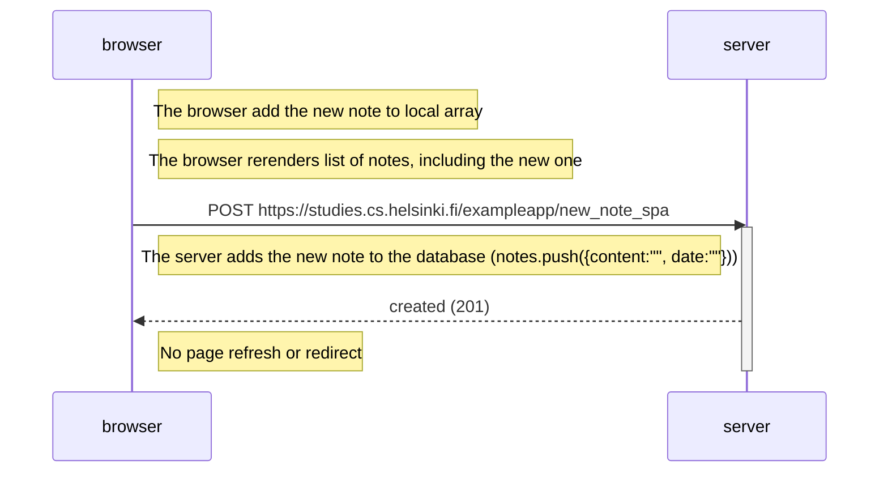

```mermaid

sequenceDiagram
    participant browser
    participant server

 Note right of browser: The browser add the new note to local array
Note right of browser: The browser rerenders list of notes, including the new one

    browser->>server: POST https://studies.cs.helsinki.fi/exampleapp/new_note_spa
    activate server
     Note left of server: The server adds the new note to the database (notes.push({content:"", date:""}))
    server-->>browser: created (201)
      Note right of browser: No page refresh or redirect
    deactivate server
```
