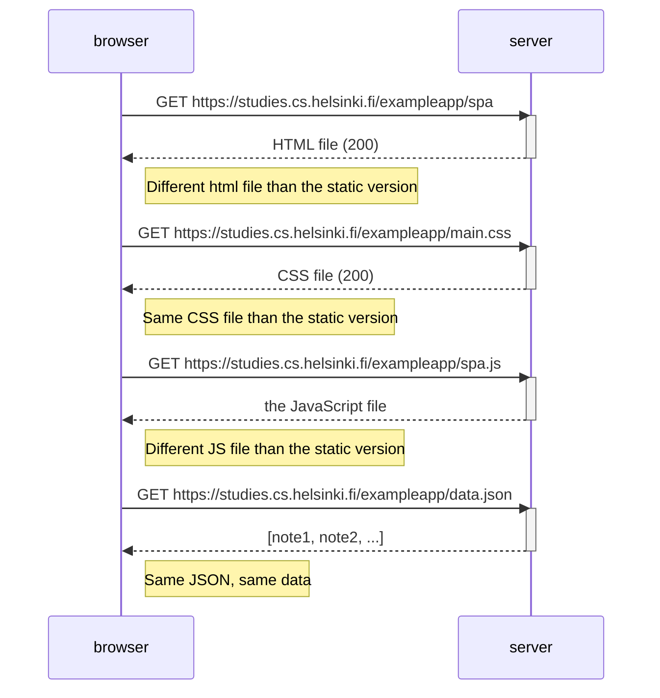

```mermaid

sequenceDiagram
    participant browser
    participant server


    browser->>server: GET https://studies.cs.helsinki.fi/exampleapp/spa
    activate server
    server-->>browser: HTML file (200)
    deactivate server

    Note right of browser: Different html file than the static version

    browser->>server: GET https://studies.cs.helsinki.fi/exampleapp/main.css
    activate server
    server-->>browser: CSS file (200)
    deactivate server
    Note right of browser: Same CSS file than the static version

    browser->>server: GET https://studies.cs.helsinki.fi/exampleapp/spa.js
    activate server
    server-->>browser: the JavaScript file
    deactivate server
    Note right of browser: Different JS file than the static version


    browser->>server: GET https://studies.cs.helsinki.fi/exampleapp/data.json
    activate server
    server-->>browser: [note1, note2, ...]
    deactivate server

    Note right of browser: Same JSON, same data
```
